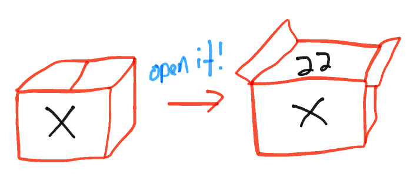

# Variables

A `variable` is a box that contains a piece of information, to be saved for later use. You give it a name that describes what its contents are, and to also refer to it at a later point.



The concept of a `variable` is a central concept within programming. It's applied the same way across almost all programming languages. In JavaScript we apply it by using a special `keyword`, a word that is reserved by the language because it has a special meaning. The keywords in JavaScript are `var`, `let` and `const`. More on the difference between these later.

> Think of variables names like **labels** on boxes, while the value of the variable are the **contents** of the box - you could change the contents of a box and leave the label intact, the contents of the boxes can have different types, the boxes should have good labels (a box of books being labeled pens would be very confusing),
>

> Photo from [Khan Academy](http://cs-blog.khanacademy.org/2013/09/teaching-variables-analogies-and.html)

A variable always contains a `value`: the piece of information that you want to save and refer to at a later stage. Read more about this here:

- [Values](./javascript/values.md)

When creating variables, it's important to think about the right name to give it. It should always reflect what "type" of data it contains and what its purpose is. You (and other developers that will read your code) should be able to read a variable name and know what its purpose is.

## Why do we need variables?
Why do we need variables? You'll be using variables **to manipulate its content** (the value inside the variable). Why would you want to do this? For most of the time, you want to perform some kind of calculation. The most basic example is the following:

```js
const one = 1;
const two = one + one;
```

Here we have assigned to a new variable the calculation `one` plus `one`. Why have we put the end result into a new variable? It is because the result of the calculation will **not be remembered** later. Memory works differently in computers: after a calculation is finished a computer thinks its job is done. The result will not exist after, unless explicitly captured within a variable.

## The keywords: let, const, var

### var
Prior to JavaScript ES6 (a version of JavaScript, the language itself is also still evolving) the `var` keyword was the only way to declare a variable. ES6 introduced two new keywords, `let` and `const` for declaring variables. They improve on how the older `var` declaration works (this involves the concept of "scope", which you will learn later). At bgoonz we encourage you to use the more modern `let` and `const` keywords over `var`, but you will often come across `var` in existing books, software libraries and examples on the Internet, so you should understand `var` too.

### let and const


- read about [let](https://developer.mozilla.org/en-US/docs/Web/JavaScript/Reference/Statements/let)
- read about [const](https://developer.mozilla.org/nl/docs/Web/JavaScript/Reference/Statements/const)
- read about [let vs const](http://wesbos.com/let-vs-const/)

Here, we say: "declare variable foo and initialize it with the integer (number) 6".

```js
let foo;  // declare variable `foo`. It will be undefined as default
```

```js
let foo = 6; // declare and assign a variable at the same time
```

You can also assign a value to an existing variable:
```js
let foo;
foo = 4;  // change variable `foo`
```
